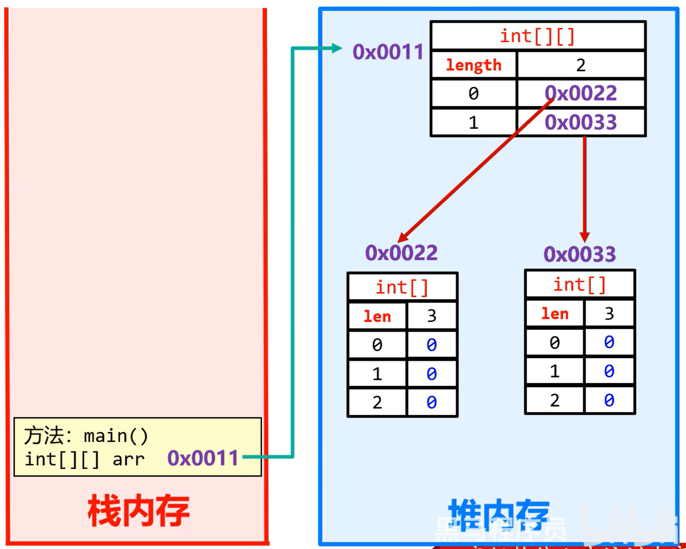
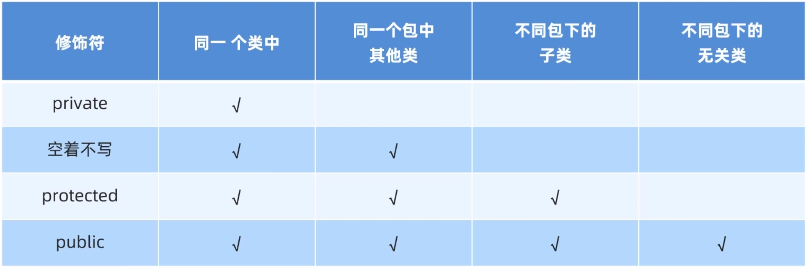
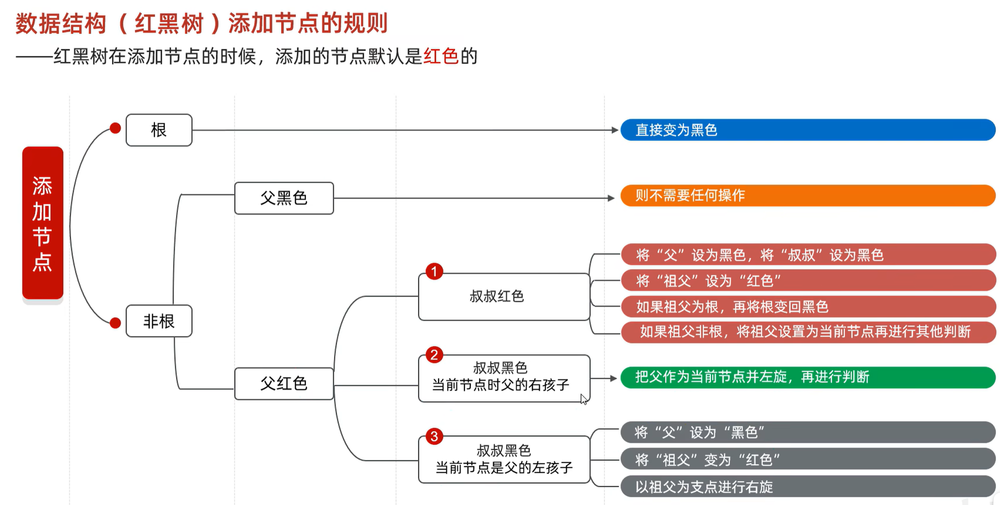

# JavaNotebook

# 基础概念

- 关键字：被 *Java* 赋予了“特定涵义”

# 运算符

- *byte*，*short*，*char* 参与计算会转为 *int* 类型。其中 *char* 需查询 ASCII 码表。
- `short a = 1; a += 1;// 等同于 a = (short)(a + 1);`
- ^ ：异或符号，相同为 *false*，不同为 *true*。
- 短路运算符：&&，||；最终效果同&，|，但具备短路效果，从左开始判断，能确定最终效果时右边不会运行。（见Test2.java）
  
    ```java
    public class Test2 {    
    	public static void main(String[] args) {
    		int a = 10;        
    		int b = 10;        
    		boolean result = ++a < 5 && ++b < 5;        
    		System.out.println(result);        
    		System.out.println(a);        
    		System.out.println(b);    
    	}
    }
    
    Out:
    false
    11
    10
    ```
    
- 三元运算符：
    - `（条件表达式）？表达式1：表达式2；`
    - 如果条件表达式为 *true*，就输出打印表达式1的内容；如果条件表达式为 *false*，就输出打印表达式2的内容。
- 原码，反码，补码
    - 原码：十进制数据的二进制表现形式，最左边为符号位，0为正，1为负。
    - 反码：正数的反码是其本身。负数的反码是在原码的基础上，符号位不变，数值取反，0变1，1变0。
    - 补码：正数的补码是其本身。负数的补码是在反码的基础上+1。这样可以解决负数加法跨0的问题。与此同时会多出-128这个数字，该数字没有原码、反码，只有补码10000000。
    - 以上，计算机中，数值的储存都是用补码来储存。

# 判断和循环

- *if* 的注意点：如果对一个布尔类型变量进行判断，不要用“==”号，避免少打等于号，直接把变量写在小括号里。
  
    ```java
    boolean flag = true; 
    if (flag) { 
    	System.out.println("flag的值为true"); 
    }
    ```
    
- switch：
    - 表达式：取值为 *byte*、*short*、*int*、*char*。JDK5后可以是枚举，JDK7后可以是 *String*。
    - *case*：后面跟着的是要和表达式进行比较的值，只能是字面量，不能是变量，且不允许重复。
    - *case* 穿透：语句体中没有写 *break* 导致。若有语句体重复的情况，可以使用case穿透简化代码（见Day04-code.test.Test7）。
    - *switch* 简化写法：
      
        ```java
        switch (number) { 
        	case 1 -> System.out.println("...") 
        	case 2 -> System.out.println("...") 
        	case 3 -> System.out.println("...") 
        	default -> System.out.println("...")
        }
        -----------OR------------
        switch (number) { 
        	case 1 -> { System.out.println("...") } 
        	case 2 -> { System.out.println("...") } 
        	case 3 -> { System.out.println("...") } 
        	default -> { System.out.println("...") }
        }
        ```
    
- *for* 循环和 *while* 循环：
  
    ```java
    for (int i = 1; i <= 10; i++) { 
    	System.out.println("HelloWorld!"); 
    }
    ```
    
    - 初始化语句只会执行一次。
    - 区别：控制循环的变量，*for* 循环在结构里面，循环结束后不能再次访问；*while* 循环在结构外面，循环结束后可以继续使用。
- 无限循环：
  
    ```java
    for (;;) {
    	System.out.println("Study");
    }
    -----------------or------------------
    while (true) {
    	System.out.println("Study");	
    }
    ```
    
    - *while* 的无限循环更常用。
- 跳转循环：
  
    ```java
    for (int i = 1; i <= 5; i++) { 
    	if (i == 3) { 
    		continue; 
    	} 
    System.out.println(i); 
    }
    ------------or------------------
    for (int i = 1; i <= 5; i++) { 
    	System.out.println(i); 
    		if (i == 3) { 
    			break; 
    		} 
    }
    ```
    

# 数组

- 两种定义形式：
    - `int[] array = {...}` 或者 `int[] array = new int[] {...}` ————常用
    - `int array[] = {...}` 或者 `int array[] = new int[] {...}`
- 动态初始化：`String[] arr8 = new String[50];`
    - 整数类型默认初始化值：0
    - 小数类型默认初始化值：0.0
    - 字符类型默认初始化值：‘000’，显示为空格
    - 布尔类型默认初始化值：false
    - 引用数据类型默认初始化值：null

# 方法

- 方法是程序中最小的执行单元。提高代码**复用性**和**可维护性**。
- 最简单的方法定义和调用方式：
  
    ```java
    public static void main(String[] args) {
    	方法名();
    }
        
    public static void 方法名() {
    	...
    	方法体
    	...
    }
    ```
    
- 带参数的方法定义和调用方式：
  
    ```java
    public static void main(String[] args) {
    	方法名(参数);
    }
        
    public static void 方法名(参数类型 参数名1, 参数类型 参数名2) {
    	...;
    	方法体;
    	...;
    }
    ```
    
    - 方法调用时，参数的数量和类型必须与方法定义中小括号里面的变量一一对应，否则程序将报错。
    - 形参：形式参数，是指方法定义中的参数
    - 实参：实际参数，方法调用中的参数
- 带返回值的方法定义和调用方式：
  
    ```java
    public static void main(String[] args) {
    	数据类型 数据名 = 方法名(参数);
    }
        
    public static 返回值类型 方法名(参数类型 参数名1, 参数类型 参数名2) {
      	...;
    	方法体;
    	...;
    	return 返回值;
    }
    ```
    
    - `return;` 后面的所有语句不执行，就算 `return;` 在循环里面。
- 方法的重载
- 在同一个类中，定义了多个同名的方法，这些同名的方法具有同种的功能。
- 每个方法具有不同的参数类型或参数个数或参数顺序，这些同名的方法构成了重载关系。
- 方法内存原理
    - 方法被调用后，会被放进栈内存运行，调用完后就出栈，但若方法中调用了第二个方法，需要第二个方法出栈后，第一个在出栈，层层叠加。
- 基本数据类型和引用数据类型
    - 基本数据类型：变量中存储的是真实的数据，*eg:* `int` `double` `byte` `boolean` `char`*.*
    - 引用数据类型：变量中存储的是地址值，*eg:* `int[] arr`*.*
    - 传递基本数据类型时，传递的是真实的数据，形参的改变，不影响实际参数的值
    - 传递引用数据类型时，传递的储存数据的地址值，此时改变形参，会影响实际参数的值
- 作业之一：一个大V直播抽奖，奖品是现金红包，分别有{2,588,888,1000,10000}五个奖金。请使用代码模拟抽奖，打印出每个奖项，奖项的出现顺序要随机且不重复。打印效果如下：（随机顺序，不一定是下面的顺序）
  
    ```java
    package com.Javastudy.demo;
    import java.util.Random;
    
    public class Demo {
    	public static void main(String[] args) {
    	Random r = new Random();
        int[] arr = {2,588,888,1000,10000};
        int[] brr = new int[arr.length];
        int index = 0;
        while (index < arr.length) {
    	    int giftNum = r.nextInt(arr.length);
          	if (method1(arr, brr, index, giftNum)) {
    	    	System.out.println(arr[giftNum] + "元的奖金被抽出");
    			index++;
          }
        }
    }
    
    	public static boolean method1(int[] arr, int[] brr, int index, int giftNum) {
    		if (numExistOrNot(brr, arr[giftNum])) {
    			brr[index] = arr[giftNum];
    			return true;
    		}
    		return false;
    	}
    
    	public static boolean numExistOrNot(int[] brr, int num) {
    		for (int i = 0; i < brr.length; i++) {
    			if (num == brr[i]) {
    				return false;
    		    }
    		}
    		return true;
    		}
    }
    
    ```
    

# 综合练习

- 字符串拼接：
  
    ```java
    String name = "";
    name = name + "abcd";
    ```
    
- 二维数组：
    - 定义格式：
    
    ```java
    数据类型[][] 数组名 = new 数据类型[][] {
        {元素1, 元素2},
        {元素1, 元素2, ...}
    };
    ---------------------or---------------------
    数据类型[][] 数组名 = {
        {元素1, 元素2},
    	{元素1, 元素2, ...}
    };
    ---------------------or---------------------
    数据类型[][] 数组名 = new 数据类型[行数][列数];//动态初始化
    ```
    
    - 存储格式：
    
    

# 面向对象

- 类和对象
    - 类（设计图）：是对象共同特征的描述
    - 对象：是真实存在的具体东西
    - 在 *java* 中，必须先设计类，才能获得对象
    - 定义类：
    
    ```java
    public class 类名字 {
    	1.成员变量 //（代表属性，一般是名词）
    	2.成员方法 //（代表行为，一般是动词）
    	3.构造器
    	4.代码块
    	5.内部类
    }
    ----------------E.g.----------------
    public class Phone {
    	//属性（成员变量）
    	String brand;
    	double price;
    	//行为（方法）
    	public void call(){
    	
    	}
    	public void playGame(){
    	
    	}
    }
    ----------------得到类的对象----------------
    类名 对象名 = new 类名();
    Phone p = new Phone();
    ```
    
    - 用来描述一类事物的类，专业叫作：*Javabean* 类，在 *Javabean* 类中，不写 *main* 方法。
    - 编写 *mian* 方法的类，叫作测试类，在测试类中创建 *Javabean* 类的对象并进行赋值调用。
    - 一个 *Java* 文件可以定义多个 *class* 类，且只能一个类是 *public* 修饰，而且 *public* 修饰的类名必须成为代码文件名。实际开发中建议还是一个文件定义一个 *class* 类。
    - 成员变量的完整定义格式是：`修饰符 数据类型 变量名称 = 初始化值;`，一般无需指定初始化值，存在默认值。
- 封装
    - 对象代表什么，就得封装对应的数据，并提供数据对应的行为。例如：画圆需要圆的半径，因此画圆的方法需要写在圆的类中；关门的方法需要写在门的类中。
    - *private* 关键字：是一个权限修饰符，可以修饰成员（成员变量和成员方法），被 *private* 修饰的成员只能在本类中才可以访问。
    
    ```java
    public class Phone {
    	private double price;
    }
    //这样会导致在其他类中，price的值无法被更改，因此需要以下代码：
    public class Phone {
    	private double price;
    	
    	//set(赋值)，用于给成员变量赋值，方法用public修饰
    	public void setAge(double a) {
    		if (a >= 0 && a < 9999) {
    			price = a;
    		} else {
    			System.out.println("数据有误！");
    		}
    	}
    	
    	//get(获取)，用于获取成员变量的值，方法用public修饰
    	public double getAge(double price) {
    		return price;
    	}
    }
    ```
    
- 就近原则和 *this* 关键字
    - 在类中，如果成员变量和局部变量重名，采取就近原则获取变量的值。若需要指定使用成员变量，需要在变量名前加 *this.* 。E.g. `sout("this.age")`；
    
    ```java
    public class Phone {
    	private double price;
    	
    	//set(赋值)，用于给成员变量赋值，方法用public修饰
    	public void setAge(double price) {
    		if (price >= 0 && price < 9999) {
    			this.price = price;
    		} else {
    			System.out.println("数据有误！");
    		}
    	}
    	
    	//get(获取)，用于获取成员变量的值，方法用public修饰
    	public double getAge(double price) {
    		return price;
    	}
    }
    ```
    
    - *this* 关键字的本质：代表方法调用者的地址值
- 构造方法：
    - 也叫构造器、构造函数。
    - 作用：在创建对象的时候给成员变量进行赋值。
    - 格式：方法名与类名相同，大小写也要一致；没有返回值类型，也没有void；没有具体返回值，不能由 *return* 带回结果数据。
    
    ```java
    public class Student {
    	private String name;
    	private int age;
    		//空参构造
    	public Student() {
    					...
    	}
    		//带参构造
    	public Student(String name, int age) {
            this.name = name;
            this.age = age;
      }
    }
    
    -------------------调用-------------------
    public class StudentTest {
        public static void main(String[] args) {
            Student s = new Student("周", 23);
            String name = s.getName();
            int age = s.getAge();
            System.out.println(name + age);
        }
    }
    ```
    
    - 执行时机：创建对象的时候由虚拟机调用，不能手动调用构造方法；每创建一次对象，就会调用一次构造方法。
    - 如果定义构造方法，虚拟机会给出一个默认的无参数构造方法
    - 如果定义了构造方法，系统将不再提供默认的构造方法
    - 构造方法的重载：带参和无参构造方法，可以方法名相同，但参数不同。无论是否使用，都要手动书写无参构造方法和带全部参数的构造方法
- 标准的 *JavaBean* 类：
    - 类名需要见名知意
    - 成员变量需要使用 *private* 修饰
    - 至少提供两个构造方法
        - 无参构造方法
        - 带全部参数的构造方法
    - 成员方法
        - 提供每一个成员变量对应的 `setXxx()/getXxx()`
        - 如果还有其他行为，也需要写上
- 成员变量和局部变量的区别
    - 成员变量：类中方法外的变量
    - 局部变量：方法中的变量

# 面对对象综合练习

- 键盘输入两套体系：
    - 第一套：遇到空格，制表符，回车就停止接收。这些符号后面的数据不会接收，顺延到下一个输入
        - `nextInt()` 接收整数
        - `nextDouble()` 接收小数
        - `next()` 接收字符串
    - 第二套：可以接收空格，制表符，遇到回车才停止接收
        - `nextLine()` 接收字符串
    - 两套体系不能混用

# 字符串

- 字符串的内容不会发生改变，它的对象在创建后不能被修改
- 有两个创建 *String* 对象的方式：直接赋值和 *new*
  
    ```java
    //根据字节数组，创建字符串对象
    byte[] btyes = {97, 98, 99, 100};
    String s5 = new String(btyes);
    System.out.println(s5);
    ---------------out---------------
    abcd
    ```
    
    当使用双引号直接赋值时，系统会检查该字符串在串池中是否存在。
    
    - 不存在：创建新的
    - 存在：复用（地址值）
- 在 *java* 中，针对基本数据类型，“==”比较的是具体的数据值。针对引用数据类型，“==”比较的是地址值
- `char` 格式数据在比较大小时，会自动转换成 ASCII 码表进行比较
- 查表法：
  
    ```java
    String[] arr = { "零", "壹", "贰", "叁", "肆", "伍", "陆", "柒", "捌", "玖" };
    	while (money > 0) {
            int num = money % 10;
            bigMoney = arr[num] + bigMoney;
            money /= 10;
        }
    ```
    
- 通过 ASCII 码表把 `char`  转化为 `int`
  
    ```java
    int genderNum = gender - 48;
    *// 转化数字*
    ```
    
- *StringBuilder*
    - *StringBuilder* 可以看成一个容器，创建之后里面的内容是可变的
    - 作用：提高字符串的操作效率
    
    ```java
    StringBuilder sb = new StringBuilder();
    StringBuilder sb = new StringBuilder("abc");
    sb.append();
    sb.reverse();
    sb.length();
    sb.toString();
    ```
    
- 注意：这只是一个容器，不能说是字符串
- *StringJoiner*
  
    ```java
    StringJoiner sj = new StringJoiner(间隔符号);
    StringJoiner sj = new StringJoiner(间隔符号, 开始符号, 结束符号);
    sj.add();
    sj.length();
    sj.toString();
    ```
    
- 常见问题
  
    ```java
    public class Test {
    public static void main(String[] args) {
    String s1 = "abc"; // 记录串池中的地址值
    String s2 = "a" + "b" + "c"; // 复用串池中的字符串
    System.out.println(s1 == s2); // true
    ```
    

# 集合

- 可以自动扩容
- 可以存储引用数据类型，若需要存储基本数据类型，需要将其变成对应的包装类
- 定义方式
  
    ```java
    ArrayList<数据类型> list = new ArrayList<>();
    list.add();
    list.remove(element);
    list.remove(index);
    list.set();
    list.get();
    list.size();
    ```
    
- 基本数据对应的包装类：
    - *char* —> C*haracter*
    - *int* —> *Integer*
    - 其余为首字母大写，e.g. *byte* —> *Byte*

# 面向对象进阶

- *static*
  
    - 在类中使用 `public static String name` 可以使得所有该类的对象共享 *name* 这一数据，调用方式推荐为：`类名.name = "xxx"`
    - 被 *static* 修饰的成员变量，叫静态变量，被该类所有对象共享，随着类的加载而加载，优于对象出现
    - 被 *static* 修饰的成员方法，叫静态方法，多用在测试类和工具类中，*Javabean* 类中很少使用。调用方法推荐使用类名调用
        - *Javabean* 类：用来描述一类事物的类
        - 测试类：用来检查其他类是否书写正确，带有 *main* 方法的类，是程序的入口
        - 工具类：不是用来描述一类事物的，
        - 而是帮我们做一些事情的类。要求：
            1. ***类名见名知意***
            2. ***私有化构造方法***
            3. ***方法定义为静态，方便调用***
    - 注意事项：
        - 静态方法只能访问静态变量和静态方法
        - 非静态方法可以访问静态变量或静态方法，也可以访问非静态的成员变量和成员方法
        - 静态方法中没有 *this* 关键字
    
- 继承
    - `public class Student extends Person {}`
    - *Java* 只支持单继承，不支持多继承，但支持多层继承，所有的类都直接或间接继承于 *Object* 类
    
    - 若用权限修饰符 *private*，子类无法调用父类的成员
    
    - 子类如何继承父类的内容：
        - 构造方法：非私有和 *private* 都不能继承
        - 成员变量：非私有和 *private* 都可以继承，但 *private* 无法直接 调用，需要使用 *get* 和 *set* 方法设置和获取
        - 成员方法：非私有可以继承，*private* 无法继承
        
    - 虚方法表：类中常用的、非 *private*、非 *static*、非 *final* 会放进该类虚方法表，交给子类，以提高性能。也就是说子类只能继承父类虚方法表中的成员方法
    
    - 成员变量的访问特点：
        - 就近原则
          
            ```java
            name //从局部位置开始往上找
            this.name //从本类成员位置开始往上找
            super.name //从父类成员位置开始往上找
            ```
        
    - 成员方法的访问特点
        - 直接调用就近原则
        - *super* 调用，直接访问父类
        - 方法的重写：当父类的方法不能满足子类现在的需求时，需要进行方法的重写
            - 书写格式：在继承体系中，子类出现了和父类中一模一样的方法声明，我们就称子类这个方法是重写的方法
            - *@Override* 重写注解：放在重写后的方法上方，校验子类重写时语法是否正确
            - 本质：覆盖自己虚方法表中的方法
            - 注意事项和要求：
                - 名称、形参列表必须与父类中的保持一致，建议和父类保持一致
                - 子类重写父类方法时，访问权限子类必须大于等于父类
                - 子类重写父类方法时，返回值类型子类必须小于等于父类
                - 只有添加到虚方法表中的方法才可以被重写
        
    - 构造方法的访问特点
      
        ```java
        //调用方法
        super(...) //调用父类有参构造方法
        this(...) //调用本类其他构造方法
        ```
        
        - 父类中的构造方法不会被子类继承
        - 子类中所有的构造方法默认先访问父类中的无参构造，再执行自己
        - 子类在初始化的时候，有可能会使用到父类中的数据，如果父类没有完成初始化，子类将无法使用父类的数据
        - 子类初始化之前，一定要调用父类构造方法先完成父类数据空间的初始化
        - 子类构造方法的第一行语句默认都是：`super()` ，不写也存在，且必须在第一行
        - 如果想要调用父类有参构造，必须手动写 *super* 进行调用
    
- 多态
    - 同类型的对象，表现出的不同形态
    - 表现形式：`父类类型 对象名称 = 子类对象;`
    - 前提：
        - 有继承或实现关系
        - 有父类引用指向子类对象
        - 有方法重写
    - 多态调用成员的特点
        - 变量调用：编译看左边，运行也看左边
        - 方法调用：编译看左边，运行看右边
    - 多态的优势
        - 在多态形式下，右边对象可以实现解耦合，便于扩展和维护
        - 定义方法的时候，使用父类型作为参数，可以接收所有子类对象，体现多态的扩展性与便利
    - 多态的弊端
        - 不能调用子类的特有功能（编译看左边），解决方法  是转化成子类类型
          
            ```java
            Animal a = new Dog();
            Dog d = (Dog) a; //注意：无法转化成除Dog类以外的类型
            // 基于以上，可以使用如下判断语句进行类型的转换
            if (a instanceof Dog) {
            	Dog d = (Dog) a;
            	......
            } else if (a instanceof Cat) {
            	Cat c = (Cat) a;
            	......
            } else {
            	System.out.println("没有这个类型，无法转换")
            }
            
            //新特性
            if (a instanceof Dog d) {
            	......
            } else if (a instanceof Cat c) {
            	......
            } else {
            	System.out.println("没有这个类型，无法转换")
            }
            ```
    
- 包和 *final*
    - 包就是文件夹。用来管理各种不同功能的 *Java* 类，方便后期代码维护
        - 包名的规则：公司域名反写+包的作用，需要全部英文小写，见名知意。*com.javastudy.domain*
        - 全类名：*com.javastudy.domain.Student*，使用其他类时，需要使用全类名
        - 使用其他类的规则
            - 使用同一个包中的类时，不需要导包
            - 使用 *java.lang* 包中的类时，不需要导包
            - 其他情况都需要导包
            - 如果同时使用两个包中的同名类，需要用全类名
    - 被 *final* 修饰后
        - 表明该方法是最终方法，不能被重写
        - 表明该类是最终类，不能被继承
        - 该变量叫做常量，只能被赋值一次：`final int a = 10;`
            - 常量的命名规范
                - 单个单词：全部大写
                - 多个单词：全部大写，单词之间用下划线隔开
            - 细节：
                - *final* 修饰的变量是基本类型：那么变量存储的数据值不能发生改变
                - *final* 修饰的变量是引用类型：那么变量存储的地址值不能发生改变，对象内部的可以改变
    
- 权限修饰符和代码块
    - 有四种作用范围，由小到大：*private* < 空着不写（缺省/默认）< *protected* < *public*
        - 实际开发中，一般只用 *private* 和 *public*，成员变量私有，方法公开
    
    
    
    - 代码块分三类
        - 局部代码块
          
            ```java
            public class Test {
            	public static void main(String[] args) {
                    //局部代码块
                    {
                        int a = 10;
            			System.out.println(a);
            		}
            		//局部代码块，用完将消失，节约内存
            	}
            }
            ```
            
        - 构造代码块
          
            ```java
            public class Student {
            	private String name;
            	private int age;
            	//构造代码块，写在成员位置的代码块
            	{
            		System.out.println("开始创建对象了");
            	}
            	//构造代码块，在新建对象时先执行，避免构造方法中代码重复
            	public Student() {
            	}
            		
            	public Student(String name, int age) {
            		this.name = name;
            		this.age = age;
            	}
            }
            ```
            
        - 静态代码块：需要通过 *static* 关键字修饰，随着类的加载而加载，并且自动触发、只执行一次。使用场景：在类加载的时候，做一些数据初始化的时候使用
          
            ```java
            public class Student {
                private String name;
            	private int age;
            	//构造代码块，卸载成员位置的代码块
            	static {
            		System.out.println("静态代码块执行了");
            	}
            	//构造代码块，在新建对象时先执行，避免构造方法中代码重复
            	public Student() {
            	}
            		
            	public Student(String name, int age) {
            		this.name = name;
            		this.age = age;
            	}
            }
            ```
    
- 抽象类和抽象方法
    - 定义格式：
    
    ```java
    // 抽象方法
    public abstract 返回值类型 方法名(参数列表);
    
    // 抽象类
    public abstract class 类名{}
    ```
    
    - 注意事项
        - 抽象类不能实例化
        - 抽象类中不一定有抽象方法，有抽象方法的类一定是抽象类
        - 可以有构造方法（给子类进行初始化）
        - 抽象类的子类
        要么重写抽象类中的所有抽象方法
        要么是抽象类
    
- 接口
    - 接口是对行为的抽象
    - 定义：`public interface 接口名 {}`
    - 接口不能实例化
    - 接口和类之间是实现关系，通过 *implements* 关键词表示：
    `public class 类名 implements 接口名 {}`
    - 接口的子类（实现类）
    要么重写接口中的所有抽象方法
    要么是抽象类
    
    ```java
    public class 类名 extends 父类 implements 接口名1, 接口名2 {}
    ```
    
    - 接口中成员的特点
        - 成员变量：只能是常量；默认修饰符：`public static final`
        - 构造方法：无
        - 成员方法：只能是抽象方法；默认修饰符：`public abstract`
    - 接口和类之间的关系
        - 类和类的关系：继承关系，只能单继承，不能多继承，但是可以多层继承
        - 类和接口的关系：实现关系，可以单实现，也可以多实现，还可以在继承一个类的同时实现多个接口
        - 接口和接口的关系：  继承关系，可以单继承，也可以多继承
    - *JDK8* 后，接口中允许定义默认方法，需要用到关键字 *default* 修饰；作用：解决接口升级的问题
      
        ```java
        e.g.
        public default void show() {}
        ```
        
        - 默认方法不是抽象方法，所以不强制被重写。但是如果被重写，重写的时候去掉 *default*
        - 关键字 *public* 可以省略，*default* 不能省略
        - 如果实现了多个接口，多个接口中存在相同名字的默认方法，子类就必须对该方法进行重写
    - *JDK8* 后，允许在接口中定义静态方法，需要用 *static* 修饰
      
        ```java
        e.g.
        public static void show() {}
        ```
        
        - 静态方法只能通过接口名调用，不能通过实现类名或者对象名调用
        - *public* 可以省略，*static* 不能省略
    - *JDK9* 后，允许在接口中定义私有方法，需要用 *private* 修饰
      
        ```java
        e.g.
        private 返回值类型 方法名(参数列表) {}
        private void show() {}
        private static 返回值类型 方法名(参数列表) {}
        private static void method() {}
        ```
        
        分为两种：
        
        - 普通的私有方法：给类中默认方法服务
        - 静态的私有方法：给类中静态方法服务
    - 接口的应用之一：当一个方法的参数是接口时，可以传递接口所有实现类的对象，这种方式称之为接口多态
    - 设计模式（*Design pattern*）：是一套被反复使用、多数人知晓的、经过分类编目的、代码设计经验的总结。使用设计模式是为了可重用代码、让代码更容易被他人理解、保证代码可靠性、程序的重用性。
        - 适配器设计模式：
            - 一个接口中抽象方法过多，但是我只要使用其中一部分的时候，就可以适配器设计模式
            - 书写步骤：编写中间类 *XXXAdapter*，实现对应的接口对接口中的抽象方法进行空实现让真正的实现类继承中间类，并重写需要用的方法为了避免其他类创建适配器类的对象，中间的适配器类用 *abstract* 进行修饰

- 内部类

    - 定义：在一个类的里面，再定义一个类。举例：在A类的内部定义B类，B类就被称为内部类。内部类表示的事物是外部类的一部分，内部类单独出现没有意义

    - 访问特点：内部类可以直接访问外部类的成员，包括私有；外部类要访问内部类的成员，必须创建对象

        ```Java
        public class Car { // 外部类
            String carName;
            int carAge;
            int carColor;
            class Engine { // 成员内部类
                String engineName;
                int engineAge;
            }
        }
        ```

    - 内部类分类：
      - 成员内部类（了解）：写在成员位置的，属于外部类的成员。可以被 *private* ，默认，*protected* ，*public* ，*static* 等修饰符所修饰。获取方法：
        - 在外部类中编写方法，对外提供内部类的对象
        - 直接创建格式：`Outer.Inner oi = new Outer().new Inner();`
        - 外部类成员变量和内部类成员变量重名时，在内部类如何访问：`System.out.println(Outer.this.变量名);`
        
      - 静态内部类（了解）：静态内部类只能访问外部类中的静态变量和静态方法，如果想要访问非静态的需要创建对象
      
        - 创建格式：`外部类名.内部类名 对象名 = new 外部类名.内部类名();`
        - 调用非静态方法格式：先创建对象，用对象调用
        - 调用静态方法格式：`外部类名.内部类名.方法名();`
      
      - 局部内部类（了解）：将内部类定义在方法里面就叫做局部内部类，类似于方法里面的局部变量。外界是无法直接使用，需要在方法内部创建对象并使用。该类可以直接访问外部类的成员，也可以访问方法内的局部变量。 
      
      - 匿名内部类（掌握）：本质就是隐藏了名字的内部类，格式：
      
        ```java
        new 类名或接口名() {
            重写方法;
        };
        ```
      
        可以写在成员位置，也可以写在局部位置
      
        - 格式细节：包含了继承或实现，方法重写，创建对象。整体就是一个类的子类对象或者接口的实现类对象
        - 使用场景：当方法的参数是接口或者类时，以接口为例，可以传递这个接口的实现类对象，如果实现类只要使用一次，就可以用匿名内部类简化代码

# 集合进阶

- 单列集合：`Collection`是单列集合的祖宗接口，它的功能是全部单列集合都可以继承使用的。是***接口类***

  - `List`：添加的元素是有序（存取顺序一样）、可重复、有索引。***接口类***
    - `ArrayList`：如果想要集合中的元素可重复（用的最多）
    - `LinkedList`：如果想要集合中的元素可重复，***而且当前的增删操作明显多于查询***
    - `Vector`（了解即可）
  - `Set`：添加的元素是无序（存取顺序可能不一样）、不重复、无索引
    - `HashSet`：无序、不重复、无索引。底层：数组+链表+红黑树。***如果想对集合中的元素去重（用的最多）***
      - `LinkedHashSet`：***有序***、不重复、无索引。底层数据结构是依然哈希表，只是每个元素又额外的多了一个双链表的机制记录存储的顺序。如果想对集合中的元素去重，***而且保证存取顺序***
    - `TreeSet`：***可排序***、不重复、无索引。***如果想对集合中的元素进行排序***
      - 可排序：按照元素的默认规则（有小到大）排序
      - 底层是基于红黑树的数据结构实现排序的，增删改查性能都较好
  - 遍历方式：
    - 选代器遍历（不依赖索引）
    - 增强for遍历
    - Lambda表达式遍历
  
- 数据结构Ⅰ

  数据结构是计算机底层存储、组织数据的方式。是指数据相互之间是以什么方式排列在一起的。数据结构是为了更加方便的管理和使用数据，需要结合具体的业务场景来进行选择。一般情况下，精心选择的数据结构可以带来更高的运行或者存储效率。

  - 栈：后进先出，先进后出
  - 队列：先进先出，后进后出
    - 数据从**后端**进入队列模型的过程称为：**入队列**
    - 数据从**前端**离开队列模型的过程称为：**出队列**
  - 数组：
    - 查询速度快：查询数据通过地址值和索引定位，查询任意数据耗时相同（元素在内存中是连续存储的）
    - 删除效率低：要将原始数据删除，同时后面每个数据前移
    - 添加效率极低：添加位置后的每个数据后移，再添加元素
  - 链表（双向链表和单向链表）：
    - 链表中的结点是独立的对象，在内存中是不连续的，每个结点会储存**本结点的数据**以及**下一个结点的地址值**（或者加上前一个结点的地址）
    - 链表查询慢，无论查询哪个数据都要从头开始找
    - 链表增删相对快

- ArrayList集合底层原理

  - 利用空参创建的集合，在底层创建一个默认长度为0的数组
  - 添加第一个元素时，在底层会创建一个新的长度为10的数组
  - 存满时，会扩容1.5倍
  - 如果一次添加多个元素，1.5倍还放不下，则新创建数组的长度以实际为准

- 泛型

  - 泛型：是JDK5中引入的特性，可以在编译阶段约束操作的数据类型，并进行检查
  - 泛型的格式：`<数据类型>`
  - 注意：泛型只能支持引用数据类型。
  - 泛型的好处：
    - 统一数据类型。
    - 把运行时期的问题提前到了编译期间，避免了强制类型转换可能出现的异常，因为在编译阶段类型就能确定下来。
  - 泛型的细节：
    - 泛型中不能写基本数据类型
    - 指定泛型的具体类型后，传递数据时，可以传入该类类型或者其子类类型（不常用）
    - 如果不写泛型，类型默认是`object`
  
- 数据结构Ⅱ

  - 树
    - 度：每一个节点的子节点数量。二叉树中，每一个节点的子节点度<=2
    - 二叉查找树：
      - 每一个节点上最多有两个子节点
      - 任意节点左子树上的值都小于当前节点
      - 任意节点右子树上的值都大于当前节点
    - 二叉树查找树遍历：
      - 前序遍历：从根结点开始，然后按照**当前**结点，**左**子结点，**右**子结点的顺序遍历
      - 中序遍历（最常用）：从最左边的子节点开始，然后按照**左**子结点，**当前**结点，**右**子结点的顺序遍历。从小到大获取数据
      - 后序遍历：从最左边的子节点开始，然后按照**左**子结点，右子结点，**当前**结点的顺序遍历
      - 层序遍历：一层一层地去遍历
    - 平衡二叉树（查找树）：**任意节点左右子树**高度差不超过1
      - 旋转机制
        - 规则1：左旋
          1. 确定支点：从添加的节点开始，不断的往父节点找不平衡的节点
          2. 以不平衡的点作为支点
          3. 把支点左旋降级，变成左子节点—or—将根节点的右侧往左拉
          4. 晋升原来的右子节点—or—原先的右子节点变成新的父节点，并把多余的左子节点出让，给已经降级的根节点当右子节点
        - 规则2：右旋（方法类左旋）
        - 触发时机：当添加一个节点之后，该树不再是一颗平衡二叉树
      - 需要旋转的四种情况
        1. 左左：当根节点左子树的左子树有节点插入，导致二叉树不平衡。**一次右旋**
        2. 左右：当根节点左子树的右子树有节点插入，导致二叉树不平衡。**先局部左旋，再整体右旋**
        3. 右右
        4. 右左
  - 红黑树
    - 红黑树是一种自平衡的二叉查找树，是计算机科学中用到的一种数据结构。
    - 1972年出现，当时被称之为平衡二叉B树。后来，1978年被修改为如今的"红黑树"。
    - 它是一种特殊的二叉查找树，红黑树的每一个节点上都有存储位表示节点的颜色
    - **每一个节点可以是红或者黑**；红黑树**不是高度平衡**的，它的平衡是通过"**红黑规则**"进行实现的
    - **红黑树增删改查的性能都很好**
    - 红黑规则
      1. 每一个节点或是红色的，或者是黑色的
      2. 根节点必须是黑色
      3. 如果一个节点没有子节点**或者**父节点，则该节点相应的指针属性值为Nil，这些Nil视为叶节点，每个叶节点（Nil）是黑色的
      4. 如果某一个节点是红色，那么它的子节点必须是黑色（不能出现两个红色节点相连的情况）
      5. 对每一个节点，从该节点到其所有后代叶节点的简单路径上，均包含相同数目的黑色节点
    - 添加节点规则
      - 默认颜色：添加节点默认是红色的（效率高）



- 哈希值
  - 根据`hashCode`方法算出来的`int`类型的整数
  - 该方法定义在`Object`类中，所有对象都可以调用，默认使用地址值进行计算
  - 一般情况下，会重写`hashCode`方法，利用对象内部的属性值计算哈希值
  - 如果没有重写`hashCode`方法，不同对象计算出的哈希值是不同的
  - 如果已经重写`hashCode`方法，不同的对象只要属性值相同，计算出的哈希值就是一样的
  - 在小部分情况下，不同的属性值或者不同的地址值计算出来的哈希值也有可能一样(哈希碰撞)
  - 如果集合中存储的是自定义对象，必须要重写`hashCode`和`equals`方法